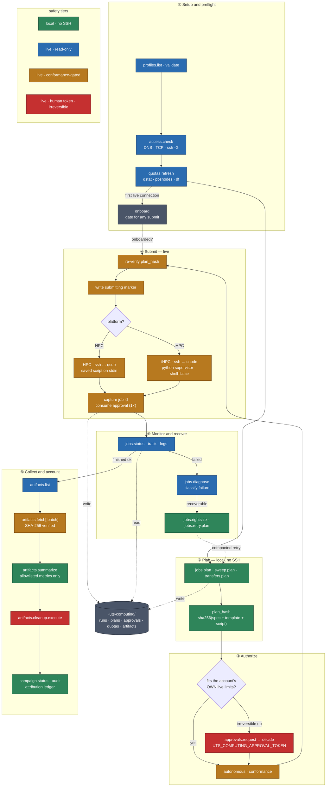
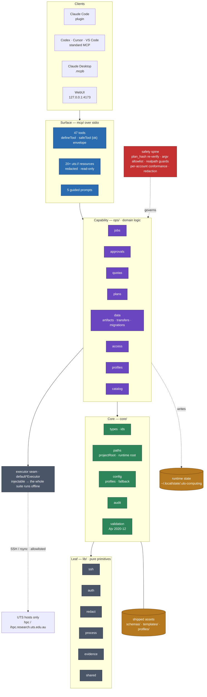

# UTS Computing Platform · `uts-compute`

> A safe, auditable bridge that lets an AI coding agent run real experiments on UTS research compute — without ever handing it a blank shell.


> [!IMPORTANT]
> **UTS-specific · unofficial · personal project.** `uts-compute` is tailored to the **University of Technology Sydney** HPC and iHPC platforms — it hardcodes UTS clusters, schedulers, queue/quota rules, and an internalized iHPC scheduler, so it will **not** work on another institution's compute without substantial adaptation. It is **not affiliated with, endorsed by, or supported by** UTS, its eResearch team, or the iHPC service. Treat it as one researcher's tooling, shared openly as a reference.
>
> **Prerequisites:** a valid UTS HPC and/or iHPC account · network access to those clusters (campus or VPN) · Node.js ≥ 18 · Claude Code or Codex. You provide your own accounts in an **untracked** `profiles/profiles.local.yaml` (copy the shape from [`profiles/profiles.example.yaml`](profiles/profiles.example.yaml)); no real credentials, ids, or secrets live in this repo.
>
> **Use responsibly, at your own risk.** Stay within each account's fair-use limits and UTS's acceptable-use policy. The multi-account features are for legitimately-held accounts, not quota circumvention. Provided **as is**, without warranty — see [LICENSE](LICENSE).

`uts-compute` is a **client-neutral package** — a local [MCP](https://modelcontextprotocol.io) server plus a set of Agent Skills — that teaches Claude Code, Codex, and other agents to drive the UTS research computing platforms **the way a careful researcher would**: plan first, check the rules, submit, watch, collect, and leave an audit trail. Every dangerous action is structurally bounded, every credential stays out of the repo, and every run is reproducible from a content hash.

**Target platforms**

| Platform | What it is | How `uts-compute` drives it |
|---|---|---|
| **UTS HPC** ([hpc.research.uts.edu.au](https://hpc.research.uts.edu.au/)) | PBS Pro batch cluster | `ssh … qsub` with a saved, hash-verified script on stdin; `qstat`/`qdel` read & cancel |
| **UTS iHPC** ([ihpc.research.uts.edu.au](https://ihpc.research.uts.edu.au/)) | Interactive GPU compute nodes | A fixed Python supervisor started over SSH (`shell=false`); for multi-GPU fan-out, `campaign.submit` ships a minimal progressor inline over SSH stdin (nothing installed on the node) |

---

## Why this exists

Pointing an autonomous agent at a real HPC account is normally reckless: one hallucinated `rm -rf`, one account-rotation to dodge a queue limit, one leaked SSH key, and you have lost data, a banned account, or both. `uts-compute` makes it **safe by construction** so the agent can be genuinely useful — iterating on jobs unattended — while staying inside hard policy boundaries.

The core ideas:

- **Plan before you touch the cluster.** Every job/transfer/cleanup is first rendered as a deterministic, local **dry-run plan** with a `plan_hash` (a SHA-256 of the normalized spec + template + script). No SSH happens during planning.
- **Content-addressed authorization.** A live action re-computes the `plan_hash` from saved bytes and refuses if it changed — a cheap dry-run approval can never bait-and-switch into an expensive job.
- **Conformance over tokens.** Reversible work (submit, transfer, fetch) self-gates on *fresh quota evidence* (≤15 min old) for the account's **own** limits. Only *irreversible* actions (cancel, remote delete, state migration) require a human confirmation token. ([ADR 0004](docs/adr/0004-quota-envelope-autonomy.md))
- **Allowlisted, never free-form.** The agent never supplies a host, a raw command, a queue, an rsync flag, or a file glob. Remote commands are fixed argv patterns; hosts are pinned.
- **Secrets never enter the repo or the logs.** Profiles reference credentials by env-var *name* and SSH alias; audit records are redacted.

---

## The experiment lifecycle



1. **Choose an account** — `profiles.list` → `access.check` (DNS/TCP/SSH preflight) → `quotas.refresh` (capture live, redacted evidence). First live connection *onboards* the profile, which is a gate for any later submission.
2. **Plan locally** — `jobs.plan` (or `sweep.plan`, `transfers.plan`) normalizes intent into a byte-deterministic plan and `plan_hash`. Pure and local.
3. **Authorize** — either the plan *conforms* to the account's own live queue/node limits (autonomous), or a human approves it with `UTS_COMPUTING_APPROVAL_TOKEN` (bound to `plan_hash` + `quota_snapshot_id`, single-use).
4. **Submit live** — `jobs.submit` re-verifies the plan, writes a crash-safe `submitting` marker, runs the fixed remote command, captures the job id, then consumes the approval.
5. **Monitor & recover** — `jobs.status` / `jobs.track` / `jobs.logs` / `jobs.diagnose`; on failure, `jobs.rightsize` advises and `jobs.retry.plan` re-plans with escalation or resume lineage.
6. **Collect** — `artifacts.list` → `artifacts.fetch[.batch]` (SHA-256 verified) → `artifacts.summarize` (allowlisted metric files only).
7. **Move & tidy** — `transfers.plan`/`execute` (fixed-file rsync) and `artifacts.cleanup.plan`/`execute` (token-gated, exact-list deletion).
8. **Account for it** — `campaign.status` / `campaign.audit` disclose which owner's allocation contributed which runs — **attribution, never concealment**.

---

## Safety & fair-use model

This is the heart of the project. Defense is layered, and each layer is enforced in code:

| Layer | What it stops | Where |
|---|---|---|
| **Dry-run boundary** | Planning ever touching the cluster | `jobs.plan`, `*.plan`, `sweep.*`, `campaign.*` run no SSH |
| **Plan integrity** | Bait-and-switch after approval | `plan_hash` re-verified on submit ([`plan-store.ts`](mcp-server/src/ops/plans/plan-store.ts)) |
| **Command allowlist** | Arbitrary remote execution | Fixed argv: `qsub` (stdin), `qstat -f`, `qdel`, `tail -c`, `rsync --files-from=-` ([`lib/ssh.ts`](mcp-server/src/lib/ssh.ts), [`ops/jobs/jobs.ts`](mcp-server/src/ops/jobs/jobs.ts)) |
| **Host pinning** | Connecting anywhere but UTS | Host aliases validated positionally; `hpc.research.uts.edu.au` / `ihpc.research.uts.edu.au` only |
| **Path confinement** | Reads/writes escaping declared roots | `assertInsideRuntime` + realpath symlink-escape checks ([`core/paths.ts`](mcp-server/src/core/paths.ts)) |
| **Secret redaction** | Credentials in logs or state | passwords/keys/tokens scrubbed before any write ([`core/audit.ts`](mcp-server/src/core/audit.ts), [`lib/redact.ts`](mcp-server/src/lib/redact.ts)) |
| **Per-account conformance** | Submitting past a queue/node cap | `checkPbsConformance` / `checkIhpcNodePoolConformance` ([`ops/quotas/conformance.ts`](mcp-server/src/ops/quotas/conformance.ts)) |
| **Token gate** | Irreversible actions slipping through | `jobs.cancel`, `artifacts.cleanup.execute`, `state.migrate.apply` require `UTS_COMPUTING_APPROVAL_TOKEN` |

### Fair use is a hard cap, never a cross-account sum

The four UTS accounts belong to **two collaborators, each owning exactly one HPC + one iHPC account**, so legitimate multi-account parallel work is policy-permitted. The package therefore **enforces and records**, it does not block:

- Every conformance check runs **one profile against its own fresh snapshot**. iHPC node-pool caps (`defaults.node_limits`, set from the portal *"My Node Limits"*) and PBS per-user `qstat -u` caps are checked **per account only — never summed**. ([`conformance.ts`](mcp-server/src/ops/quotas/conformance.ts), [docs/accounts-and-safety.md](docs/accounts-and-safety.md))
- Rotating accounts to dodge a limit is forbidden; **exceeding an iHPC node cap risks an account ban**, so the gate is real ban-prevention, not theatre.
- The campaign ledger (`campaign.status` / `campaign.audit`) exists to **disclose** per-owner attribution and **flag** any account already over its own cap — it surfaces over-use, never excuses it.

### Why a token isn't theatre — but also isn't the whole story

On a same-machine deployment the agent can read its own environment, so the approval token is a deliberate human checkpoint, **not** a cryptographic wall. What actually bounds the three irreversible operations is *structural*: manifest hashing, exact byte/ID caps, realpath containment, and per-file re-verification before each unlink. The token raises the bar; the structure binds the blast radius. ([ADR 0004](docs/adr/0004-quota-envelope-autonomy.md))

> **Secrets policy.** Never commit passwords, private keys, MFA secrets, tokens, or real account identifiers. `profiles/profiles.example.yaml` is a *shape* example with placeholders; real accounts live in an untracked `profiles/profiles.local.yaml`. The `.mcpb` bundle ships only the example.

---

## Quick start

```sh
npm install
npm test                 # build + full JS/TS + WebUI suite
npm run dry-run:sample   # render a deterministic PBS plan, no SSH
npm run webui            # local dashboard at http://127.0.0.1:4173
```

Then point the server at your real profiles by setting `UTS_COMPUTING_CONFIG` to an untracked `profiles/profiles.local.yaml` (copy [`profiles/profiles.example.yaml`](profiles/profiles.example.yaml) and fill in env-var *names* and SSH aliases — never secret values).

### Install into an agent

<details>
<summary><b>Claude Code</b> (plugin)</summary>

```text
/plugin marketplace add /absolute/path/to/uts-compute
/plugin install uts-compute@mtics-plugins
```
Verify with `/mcp` (server connected) and `/help` (the Skills). See [docs/plugin-setup.md](docs/plugin-setup.md).
</details>

<details>
<summary><b>Codex / Cursor / VS Code</b> (standard MCP)</summary>

```sh
codex mcp add uts-compute -- node "$(pwd)/mcp-server/dist/index.js"
```
All clients read the same `mcp-server/` and the `.agents/skills/` mirror — no plugin required.
</details>

<details>
<summary><b>Claude Desktop</b> (one-click <code>.mcpb</code>)</summary>

```sh
npm run build
npm run validate:mcpb
npm run pack:mcpb        # → uts-compute.mcpb (double-click to install)
```
At install you are prompted for an optional **UTS profiles file**; it defaults to the bundled example. See [docs/distribution.md](docs/distribution.md).
</details>

---

## The toolbox — 47 MCP tools

Grouped by what they do in the lifecycle. The dot-named tools all return a `{ ok, … }` envelope and surface a `config_status` so the agent always knows whether it is on real or example profiles.

| Domain | Tools |
|---|---|
| **Profiles & access** | `profiles.list` · `profiles.validate` · `profiles.onboard` · `access.check` · `access.doctor` · `access.confirm_usage` |
| **Quotas & capacity** | `quotas.refresh` · `quotas.capacity` |
| **Catalog** | `templates.list` · `projects.list` · `docs.search` · `docs.refresh` |
| **Plan & submit** | `jobs.plan` · `jobs.submit` · `jobs.retry.plan` · `jobs.adopt` |
| **Monitor & diagnose** | `jobs.status` · `jobs.track` · `jobs.logs` · `jobs.usage` · `jobs.diagnose` · `jobs.history` · `jobs.rightsize` · `jobs.cancel` |
| **Approvals** | `approvals.request` · `approvals.status` · `approvals.decide` · `approvals.list` |
| **Sweeps** | `sweep.plan` · `sweep.rank` · `sweep.retry.plan` |
| **Artifacts** | `artifacts.list` · `artifacts.fetch` · `artifacts.fetch.batch` · `artifacts.summarize` · `artifacts.cleanup.plan` · `artifacts.cleanup.execute` |
| **Transfers** | `transfers.plan` · `transfers.execute` |
| **iHPC scheduler** | `ihpc.campaign.preflight` · `ihpc.campaign.generate` · `ihpc.node.usage` |
| **Campaign** | `campaign.submit` · `campaign.status` · `campaign.audit` |
| **State migration** | `state.migrate.plan` · `state.migrate.apply` |

<details>
<summary>What the non-obvious ones do</summary>

- **`jobs.adopt`** — onboards an externally-started job into local history so the read paths can see it. A PBS-adopted job is fully reconcilable — status, **logs (derived from `qstat -f`)**, and cancel; an iHPC-adopted run is **observe**: `jobs.status` reports process liveness + node GPU without fabricating supervisor metadata, while `jobs.logs`/`jobs.cancel` stay node-side (no supervisor paths to synthesize across the profile-root boundary).
- **`jobs.submit` on iHPC** — runs a *single* process on one node, so it hard-stops any spec with `resources.array` or `ngpus > 1` and points you to `campaign.submit` instead of silently running a multi-GPU command once.
- **`campaign.submit`** — the internalized scheduler's one user-facing entry point: it composes pure decision primitives (`selectPlannedRuns → decideLease → checkIhpcNodePoolConformance → planNextBatch`) and then ships a minimal Python progressor **inline over SSH stdin** to the iHPC node (nothing installed). The node auto-progresses the plan offline; the plugin reconciles state on reconnect. Autonomous, gated by the ban-critical per-account node-pool conformance check.
- **`sweep.retry.plan`** — re-plans only the *failed* array members of a finished sweep into a new, compacted PBS array (new `run_id`/`plan_hash`, `sweep_retry_of` lineage), turning O(failures) round-trips into one re-plan. Dry-run only; re-submission still passes live conformance.
- **`ihpc.campaign.preflight`** — pure local YAML validation: checks each experiment's `--dataset` flag against datasets actually present, parses `--param_overrides` JSON, validates against an optional schema. Catches a `MovieLens`≠`ML` typo *locally*, never on the cluster. Accepts an inline queue object or a `queueYamlPath` to an existing hand-written file.
- **`ihpc.campaign.generate`** — emits a canonical `ihpc-sched` queue YAML from structured inputs, **coupled to preflight** (it refuses to emit anything preflight would reject), so the plugin owns the campaign format end-to-end: generate → validate → submit. Pure/local/dry-run.
- **`ihpc.node.usage`** — read-only per-GPU occupancy on one iHPC node (the audited replacement for manual `nvidia-smi`/`pgrep`); `jobs.track {nodeUsage:true}` fans it across every active iHPC node in one call so the whole fleet's runs + GPU come back together.
- **`artifacts.summarize {source:remote}`** — summarizes a confined, byte-bounded metric file **in place on the head node** (no fetch-first, no arbitrary cluster-side execution), so results too large or numerous to fetch still get summarized.
- **`state.migrate.plan/apply`** — scans local `.uts-computing` state, reports schema-version candidates, and (after a matching plan hash + token + per-file backup) additively stamps `schema_version`. Never touches run/approval state or the cluster.

</details>

Beyond tools, the server exposes read-only **`uts://` resources** (profiles, templates, quota-snapshots, run-records, approval-records, artifacts, transfers, docs, docs-cache — all redacted) and **5 guided prompts** (`plan-experiment`, `triage-run`, `collect-artifacts`, `stage-transfer`, `client-smoke-evidence`).

---

## Architecture



Strict downward-only layering (no cycles, enforced by a `lint-no-dup-lib-defs` pretest). The compiled server is anchored at a `projectRoot` discovered by walking up to the `uts-compute` `package.json`, so the shipped `schemas/`, `templates/`, and `profiles/` resolve no matter where the bundle is installed.

**Where state lives.** Persisted records (`runs/`, `plans/`, `approvals/`, `quotas/`, `artifacts/`, `transfers/`, `docs-cache/`, `backups/`) are written under a per-user runtime root — `UTS_COMPUTING_STATE_DIR` → `UTS_COMPUTING_HOME` → `XDG_STATE_HOME` → `~/.local/state`, then `/.uts-computing` — **never** inside the plugin install directory, so a shared install never accumulates one user's history.

**Tested deeply.** 103 test files span unit, ops, and live MCP-protocol integration (the exact 47-tool set is pinned by a registration test). Executors are injectable, so the full suite runs without ever reaching a cluster. CI runs the JS lane and a Python lane on every push.

---

## Operational dashboard (WebUI)

A dependency-light, **localhost-only** dashboard for humans who want to *see* the fleet rather than read JSON.

```sh
npm run webui        # build + serve on http://127.0.0.1:4173
npm run webui:demo   # seed sample runs, then serve
npm run webui:stop   # release the fixed port
```

It reads the **same already-redacted `.uts-computing` state** the MCP server writes (no secrets, no cluster access for reads) and renders a **Runs** operational dashboard (execution overview, a Projects glance, live iHPC **Node load**, and status / core-hours charts), per-run detail (Overview / Plan / Lifecycle / Logs / Artifacts), an **Explore** resource-fit view (with observed iHPC node-level GPU and aggregated PBS array-job usage), a first-class **Projects** index, and a **Capacity** snapshot. Live status reconcile and the node-load probe re-poll the cluster over SSH on demand. The **Node load** panel derives its node set from each iHPC account's **live held nodes** (`cnode mynodes` on the login host) rather than frozen run-record fields — new nodes appear automatically, departed nodes vanish, and a non-terminal iHPC run whose node is no longer held is auto-retired to **`stale`** on reconcile (only when the held-node probe succeeds). Write actions (clone / rerun / abort / approve) route through the *same* domain functions and gates as the MCP tools — including plan-hash re-verification and the confirmation token, which never leaves the server. See [webui/README.md](webui/README.md).

---

## Vendored iHPC scheduler (reference snapshot)

`ihpc-scheduler/` is a **decorative, reference-only snapshot** of the on-node `ihpc-sched` scheduler (originally from `git@github.com:mtics/uts-ihpc.git`, pinned at SHA `e6883a9`). It was once the deploy *payload* for the now-retired `ihpc.scheduler.deploy`/`ihpc.scheduler.version` tools.

The scheduler is now **internalized**: the plugin ships a minimal progressor inline over SSH stdin per launch (see [`ops/scheduler/seam/launch.ts`](mcp-server/src/ops/scheduler/seam/launch.ts) and [`ops/scheduler/node/progressor.py`](mcp-server/src/ops/scheduler/node/progressor.py)), so nothing is installed on the node from this tree. As a result the vendored tree is **unreferenced by `mcp-server/src` runtime**, is **excluded from the `.mcpb` bundle** (via `.mcpbignore`), and is kept in git only as a historical provenance reference.

There is **no live provenance enforcement**: the `PROVENANCE.json`/`UPSTREAM` files are a one-time source note, there is no `check:provenance` guard and no re-vendoring script, and CI does not assert the tree is unmodified. (CI still runs the tree's own pytest suite — see [Development](#development) — purely as a regression check on the vendored code that remains.)

The internalized design — *plugin as the brain, node as a minimal progressor* — is specified in [docs/superpowers/specs/2026-06-20-ihpc-scheduler-internalized-design.md](docs/superpowers/specs/2026-06-20-ihpc-scheduler-internalized-design.md).

---

## Distribution

One source of truth (`mcp-server/` + Skills) ships to four surfaces ([docs/distribution.md](docs/distribution.md)):

| Surface | How users get it | Maintained artifact |
|---|---|---|
| Claude Code | `/plugin install` from the marketplace | `.claude-plugin/` + `marketplace.json` + `.mcp.json` |
| Codex (+ Cursor, VS Code) | standard MCP config + `SKILL.md` discovery | shared `mcp-server/` + `.agents/skills/` |
| Claude Desktop | install a `.mcpb` bundle | `manifest.json` (+ `.mcpbignore`) |
| MCP registry | `server.json` under `io.github.mtics/…` | `server.json` |

All four declare version **0.1.6** in lockstep (the server reports it dynamically from `package.json`, so there is no hand-maintained literal to drift).

---

## Skills (14)

Skills are the *policy* layer — they tell the agent **when** to ask for approval, **how** to escalate, **what** to verify — while the MCP tools do all the side effects.

| Skill | Purpose |
|---|---|
| `select-profile` | Pick, validate, and onboard one account; preflight VPN/SSH/quotas |
| `plan-experiment` | Turn intent into a validated `JobSpec` and a dry-run plan |
| `hpc-submit-pbs` / `ihpc-run-background` | Lower-level single-job submit building blocks |
| `run-experiment` | Full orchestrator: plan → capacity → submit → **mandatory status verify** |
| `run-sweep` | Grid → one PBS array → watch → collect → rank |
| `monitor-and-recover` / `triage-and-retry` | Diagnose a failure and re-plan with escalation or resume |
| `reproduce-run` | Re-run a past run with a fresh `plan_hash` |
| `fleet-status` | Read-only view of all active runs and per-project rollups |
| `review-approvals` | Operator checkpoint: list pending → decide with token |
| `analyze-artifacts` | Narrow, allowlisted artifact inspection (no glob/browse) |
| `stage-transfer` | Fixed-file rsync: plan → execute |
| `confirm-usage` | Parse an iHPC usage email and confirm live |

---

## Development

```sh
npm test                  # build + node --test (JS/TS + WebUI)
npm run build             # tsc → mcp-server/dist
npm run lint              # forbid duplicate lib definitions
npm run test:python       # vendored scheduler's own pytest (needs paramiko/pyyaml)
npm run validate:plugin   # validate the Claude plugin shim
npm run smoke:plugin      # host-neutral MCP stdio smoke test
```

CI (`.github/workflows/ci.yml`) runs two lanes on every push/PR: **js** (`npm ci` → `npm test`) and **python** (the vendored scheduler's own pytest suite). There is no provenance-enforcement lane. Contributions should keep the core **client-neutral** — no Claude-only behavior outside `.claude-plugin/` (see [CLAUDE.md](CLAUDE.md), [AGENTS.md](AGENTS.md)).

---

## Documentation map

| Doc | What it covers |
|---|---|
| [docs/README.md](docs/README.md) | The full document map |
| [docs/architecture.md](docs/architecture.md) | MCP / Skills / profiles / schemas / templates architecture |
| [docs/architecture-deep-dive.md](docs/architecture-deep-dive.md) | In-depth subsystem walkthrough |
| [docs/accounts-and-safety.md](docs/accounts-and-safety.md) | Multi-account & fair-use policy |
| [docs/research-basis.md](docs/research-basis.md) | Platform facts and external sources |
| [docs/distribution.md](docs/distribution.md) | The four distribution surfaces |
| [docs/failure-playbooks.md](docs/failure-playbooks.md) | Safe triage steps for common failures |
| [docs/adr/](docs/adr/) | Architecture Decision Records (incl. 0004 conformance autonomy, 0005 standards-first distribution) |

---

## Status

Actively developed; milestones **M1–M5** shipped (local dry-run → read-only context → approvals → live PBS submission + iHPC supervised start → monitoring/logs/cancel → artifact/transfer loop → shared-plugin/state hardening), with the WebUI operational workbench and the internalized iHPC scheduler the most recent additions. This is a **private, internal package** for the UTS collaborators; it ships no public license.

> Real credentials, private keys, passwords, MFA material, and UTS account identifiers must never be committed. When in doubt, keep it in an untracked `*.local.yaml`.
