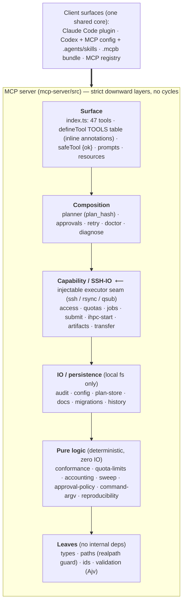
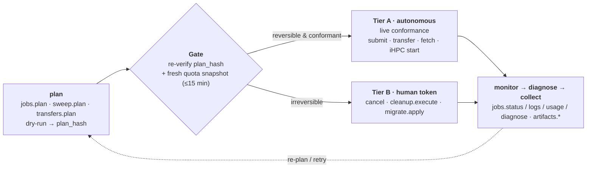

# Architecture Overview

A cross-cutting, whole-project map of **uts-compute** — how the pieces fit, why, and where the trust comes from. For the per-tool reference see [architecture.md](architecture.md); for decisions see [adr/](adr/); for source-backed facts see [fact-registry.md](fact-registry.md).

## What it is

A **client-neutral** MCP server + Agent Skills package that turns "run an ML experiment on university HPC" into a **safe, auditable experiment-lifecycle pipeline** over **UTS HPC** (PBS / the CETUS cluster) and **UTS iHPC** (supervised interactive nodes). It ships as one Claude Code plugin plus standard MCP config + `.agents/skills` for every other client.

**Scale:** 47 MCP tools · 15 Skills · 5 prompts · 10 `uts://` resource collections · 5 templates · 23 JSON Schemas · 103 test files · 76 TS modules.

Two ideas carry the whole design:

1. **Content-addressed, re-verified execution.** Every state-changing action is split into a dry-run that emits a deterministic `plan_hash`, and an execute phase that **recomputes that hash from the artifact's own bytes** before touching anything remote. Tampered local state is mechanically rejected.
2. **Conformance, not tokens (ADR 0004).** In a same-machine deployment the agent can read/set its own approval token, so a per-submission token is security theatre. Authority is grounded in the platform's *live per-account quota envelope*; only genuinely **irreversible** actions (cancel a job, delete files, migrate state) keep a human confirmation token.

## Layered architecture

Mermaid source (editable)

Dependencies point strictly leaf-ward; `types`/`paths`/`ids`/`validation` sink to the bottom with no upward imports and there are **no cycles**. The load-bearing high-fan-in core is `audit` (13 importers), `config` (11), and `planner` (10 — every action module re-derives `planHashForPlan` to detect tampered local state).

### Layer responsibilities

| Layer | Modules → responsibility |
|---|---|
| **Surface** | `index.ts` (server bootstrap, 47 tool registrations, the declarative `defineTool` `TOOLS` table with inline safety annotations, the `safeTool` `{ok,...}` envelope), `prompts.ts` (kept pure — completers injected), `resources.ts` (`uts://`), `cli.ts`, `test-executors.ts` (test mocks, deliberately out of the prod entrypoint) |
| **Composition** | `planner` (the dry-run hub + `plan_hash`), `approvals` (request/decide/status/consume), `onboarding` (first-run gate + `profiles.onboard`), `retry`, `doctor` (composes `access.check` + clock-skew + scheduler), `diagnose` (status+logs → failure class) |
| **Capability / SSH-IO** | `access` (defines the base `CommandExecutor`/`defaultCommandExecutor` spawn primitive), `quotas`, `jobs`, `submit`, `ihpc-start`, `artifacts`, `transfer` — each behind an injectable `*Executor` |
| **IO / persistence** | `audit` (run-records + `redactCommand`), `config` (profiles + path redaction), `plan-store`, `docs`, `migrations`, `history`, `projects` (per-project rollup over run-records) |
| **Pure logic** | `conformance` (the autonomy gate), `capacity` (per-queue headroom + recommended parallelism), `rightsize` (requested-vs-used advisory), `spec-diff` (vs latest prior run), `quota-limits` (PBS limit parsing), `accounting` (qstat usage + exec node), `sweep` (grid expansion), `approval-policy`, `command-argv`, `submission-approval`, `reproducibility` (injectable git probe), `project` (git-derived grouping + content-addressed `project_hash`) |
| **Leaves** | `types` (all domain interfaces), `paths` (`assertInsideRuntime` + `assertRealPathInside` symlink-escape guard), `ids` (`assertSafeRunId`), `validation` (Ajv-compiled schema guards) |

### Runtime & the executor seam

A tool call flows: client `callTool` → `safeTool(handler)` (success → `{ok:true, ...body}`; throw → `{ok:false, error}`; emits both `structuredContent` and pretty text) → domain function (fs reads/writes; capability modules invoke their **injected executor** to run `ssh`/`rsync`/`qsub` via `spawn(shell:false)`).

The **executor-injection seam** is the testability backbone: every SSH/rsync/qsub boundary is a function type (`CommandExecutor` and its per-domain widenings adding `stdin`), resolved as `options.executor ?? defaultXxxExecutor`. The only real `spawn` calls live in a handful of `default*Executor` constants. Tests pass a stub executor (and `gitRunner`/`fetcher`/`dnsLookup`/`tcpCheck`) to exercise the full parse→redact→record pipeline with canned `{exitCode, stdout, stderr}` and never touch a live cluster. The same seam is reachable through the real stdio server via env flags (`UTS_COMPUTING_TEST_MODE` + `*_TEST_JOB_OPS`/`*_TEST_DOCS`), which is how `mcp-protocol.test.mjs` drives SSH-shaped tools end-to-end.

## The safety-gated lifecycle

Mermaid source (editable)

The functional surface maps onto this lifecycle. Tools use **dot-notation** `domain.verb`; Skills use **verb-noun**; resources use a REST plural-collection / singular-item pattern under `uts://`.

| Phase | Tools (safety mode) |
|---|---|
| **onboard / plan** | `profiles.onboard` *(first-run gate)* · `profiles.list`/`validate` · `access.check`/`access.doctor` · `access.confirm_usage` *(iHPC node-usage email response)* · `docs.search`/`refresh` · `quotas.refresh` · `quotas.capacity` *(headroom + parallelism advice)* · `templates.list` · `jobs.plan` *(→ plan_hash)* · `jobs.retry.plan` · `sweep.plan` *(capacity-tuned)* · `sweep.retry.plan` *(re-plan failed members, dry-run)* · `transfers.plan` |
| **submit** | `jobs.submit` (PBS autonomous / iHPC supervised) · `transfers.execute` *(destructive)* |
| **monitor** | `jobs.status` · `jobs.track` (one-sweep live status + terminal-transition digest) · `jobs.logs` · `jobs.usage` (core/GPU-hours, efficiency) · `jobs.history` · `projects.list` (per-project rollup) · `campaign.status`/`campaign.audit` (campaign ledger: disclose allocations + flag over-cap accounts) · `jobs.rightsize` (requested-vs-used advisory) |
| **diagnose** | `jobs.diagnose` (classify failure + safe next action) |
| **collect** | `artifacts.list` · `artifacts.fetch`/`.fetch.batch` (SHA-256) · `artifacts.summarize` · `sweep.rank` (rank array members → top-k follow-up) |
| **cleanup / gate / maint** | `artifacts.cleanup.plan`/`.execute` *(destructive)* · `jobs.cancel` *(destructive)* · `approvals.request`/`status`/`decide` · `state.migrate.plan`/`apply` *(destructive)* |

- **15 Skills** (policy + orchestration, never direct execution): 7 single-step building blocks — `plan-experiment` (entry), `select-profile`, `hpc-submit-pbs`, `ihpc-run-background`, `monitor-and-recover`, `stage-transfer`, `analyze-artifacts` — plus 6 end-to-end orchestrators that compose them: `run-experiment` (onboard→capacity→plan→authorize→submit→verify), `review-approvals` (Tier-B confirmation), `triage-and-retry` (diagnose→branch→retry), `fleet-status` (cross-project dashboard), `reproduce-run`, `run-sweep` — plus `confirm-usage`, a standalone iHPC-monitoring email responder that drives `access.confirm_usage`; and the cross-cutting `consult-platform-docs`, which sends the agent to the official UTS HPC/iHPC documentation when it is unsure of a platform operation or the user needs a capability the plugin does not expose. Each ends with a "do not substitute direct shell/SSH/PBS/rsync for MCP tools" guardrail.
- **5 prompts** (guided entry points, guidance only): `plan-experiment`, `triage-run`, `collect-artifacts`, `stage-transfer`, `client-smoke-evidence`; `profileId`/`runId` args have `completable()` autocompletion.
- **`uts://` resources** (sanitized/redacted read-only state): `profiles`, `templates`, `projects`, `docs`, `quota-snapshots`, `run-records`, `approval-records`, `artifacts`, `transfers`, `docs-cache` collections + singular item templates (e.g. `uts://run-records/{runId}`, `uts://projects/{projectHash}`, `uts://artifacts/{runId}/manifest`).
- **Templates** (`templates/`): `pbs/{cpu,gpu,array}.pbs.hbs`, `ihpc/background-run.sh.hbs`, `transfer/rsync-stage.sh.hbs` — rendered server-side only after schema validation; users cannot inject flags.

## The safety spine

**1 · plan→execute + `plan_hash`.** `jobs.plan` hashes (`sha256` over canonical stable JSON) the *normalized* job spec + chosen template + **fully rendered script** (+ operation class / retry lineage). The run-record stores the hash plus a reproducibility block (git sha/branch/dirty + redacted command) and a git-derived **project** + content-addressed `project_hash` (so concurrent experiments from different repos stay distinguishable and groupable) — both are recorded but **never folded into `plan_hash`**, so git dirtiness or a project relabel can't destabilize it. Every executor (`submit`/`ihpc-start`/`jobs`/`artifacts`/`transfer`) recomputes and compares before acting.

**2 · Quota-envelope autonomy (ADR 0004) — two tiers.**
- **Tier A · autonomous** (`jobs.submit`, retry, `transfers.execute`, `artifacts.fetch`/`.fetch.batch`, iHPC start): no human token; gated by a `≤15-minute-fresh` `quota_snapshot_id` + live conformance — PBS queue enabled/started + ACL + `resources_max` + per-user `max_run`/`max_queued` (user→group→generic precedence) + storage headroom; iHPC active-cnode session; transfer/fetch by `plan_hash` + fixed file list + byte caps + SHA-256. Non-conformance throws the specific violated limit so the agent re-plans smaller. The run-record logs `approval: { state: "not_required", ... bound_plan_hash, bound_quota_snapshot_id }`.
- **Tier B · human confirmation token** (`jobs.cancel`, `artifacts.cleanup.execute`, `state.migrate.apply`): a required `approvalId`; `approvals.decide` needs the host-supplied `UTS_COMPUTING_APPROVAL_TOKEN` ("model text alone is not approval"). Approval ids are deterministic, single-use, and bound to `plan_hash` + `quota_snapshot_id` + `scope_hash`.

**3 · Redaction · SSH allowlist · realpath guards.** `redactCommand` scrubs secrets; `maskUserRootPath` replaces usernames after declared mount roots (longest-prefix-wins). All remote execution is `spawn(shell:false)` with hardened SSH (`BatchMode`/`PasswordAuthentication=no`/`StrictHostKeyChecking=yes`) and **argv-level allowlists** (only `qstat -f`/`qstat -x -f`/`qdel`/`tail -c`; iHPC runs a fixed `python3 -` + base64 spec — never arbitrary shell). `assertRealPathInside` defeats symlink escape via realpath comparison.

**4 · Data model — `.uts-computing/` (gitignored).** `runs/` (run-record: status machine + plan_hash + approval + supervisor + **submission context** {account/cluster/queue/node/requested} + observed **usage** + events + reproducibility + project + job_type), `plans/`, `quotas/` (snapshots), `onboarding/` (per-profile first-run markers), `approvals/`, `artifacts/<run>/` (manifest + evidence + fetched files), `transfers/<run>/`, `access/`, `job-ops/`, `backups/`. Every directory is governed by a schema (validated on **read and write**, `additionalProperties:false`). `state.migrate` provides additive schema-version migration (plan is no-write; apply backs up then atomically writes).

**5 · First-run onboarding gate.** Before any live submission a profile must have completed `profiles.onboard` — a real connection that observes the remote identity and captures the account's resource-allocation limits — recorded as a persistent marker (an existing quota snapshot also satisfies the gate). Dry-run `jobs.plan` is never gated. This is the explicit upfront "confirm the account works and discover its limits before you submit" step.

## Distribution — standards-first (ADR 0005)

One shared core (`mcp-server/dist` + `skills/`) projected onto four surfaces:

| Surface | How | Launch |
|---|---|---|
| **Claude Code** | `/plugin install` from `mtics-plugins` marketplace | `.mcp.json` → `node ${CLAUDE_PLUGIN_ROOT}/mcp-server/dist/index.js` |
| **Codex / Cursor / …** | standard MCP config + `SKILL.md` discovery | `codex mcp add` (absolute path) + `.agents/skills/` symlink mirror |
| **Claude Desktop / one-click** | `.mcpb` bundle | `manifest.json` → `${__dirname}/...` |
| **MCP registry** | `server.json` (`io.github.mtics/uts-compute`) | references the released `.mcpb` |

The Codex plugin wrapper was retired because MCP + Agent Skills are open standards Codex consumes natively, and Codex's `${PLUGIN_ROOT}` substitution inside MCP config is undocumented (a release risk) — an absolute path is CWD-independent anyway.

## Decision history (ADRs)

| ADR | Decision |
|---|---|
| **0001** | Shared MCP + Skills package (dual-plugin parts superseded by 0005) |
| **0002** | Multi-account safety: every live op binds one `profile_id`; **no automatic cross-account distribution**; profiles store references, not secrets (in force) |
| **0003** | Plugin shim contract: client-specific MCP config + plugin-root launch var (partially superseded by 0005) |
| **0004** | Quota-envelope autonomy: live conformance replaces the per-submission token; thresholds demoted to advisory; only `cleanup.execute` (and cancel/migrate) keep the token (implemented) |
| **0005** | Standards-first distribution: retire the Codex plugin wrapper; one Claude plugin + standard MCP/Skills + `.mcpb` + registry |

## Quality gates

`build (tsc → dist)` + `103 test files` (per-domain `*.test.mjs` + one stdio protocol test `mcp-protocol.test.mjs`) + `validate:plugin` (static plugin-structure check) + host-neutral smoke (spins the real server in a temp plugin root and runs offline dry-runs) + per-method installed-client smoke evidence.

## Essence

A cleanly stratified, dependency-inverted MCP server: a thin stdio surface wraps 47 dot-notation tools in a uniform `{ok}` envelope and centralizes safety posture through inline `defineTool` annotations; a function-typed executor seam isolates all real SSH/rsync to a few `default*Executor` constants (making the whole pipeline testable); domain logic sinks into pure, schema-validated modules; and threading through everything is ADR 0004's **"autonomous where machine-verifiable, confirm where irreversible"** philosophy — backed by content-addressed `plan_hash` re-verification, argv allowlists, realpath guards, and pervasive redacted evidence — so an agent can run experiments on university HPC both **autonomously and trustworthily**.
